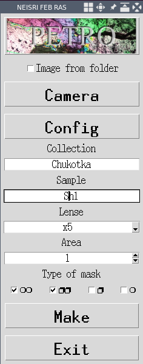
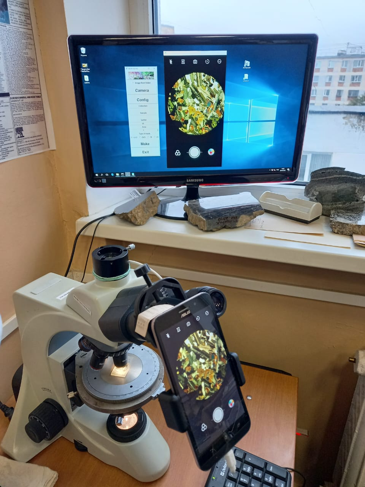
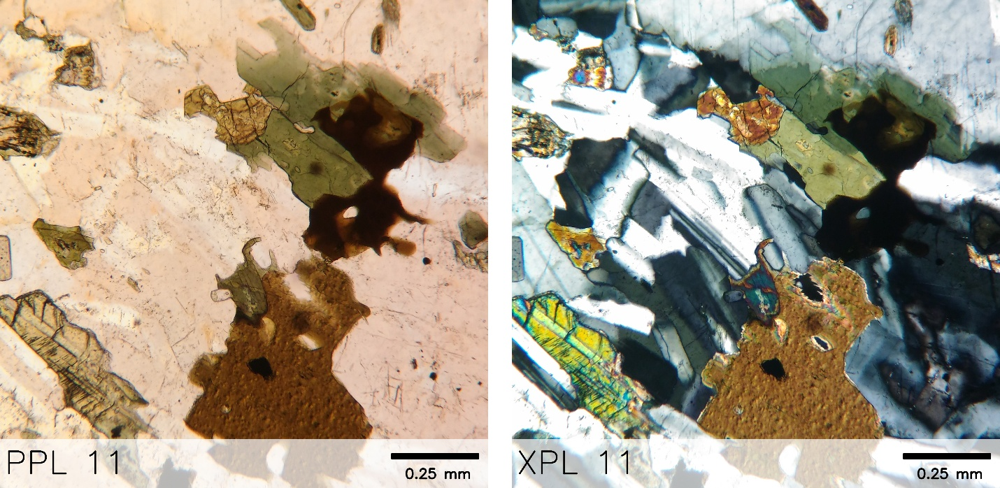
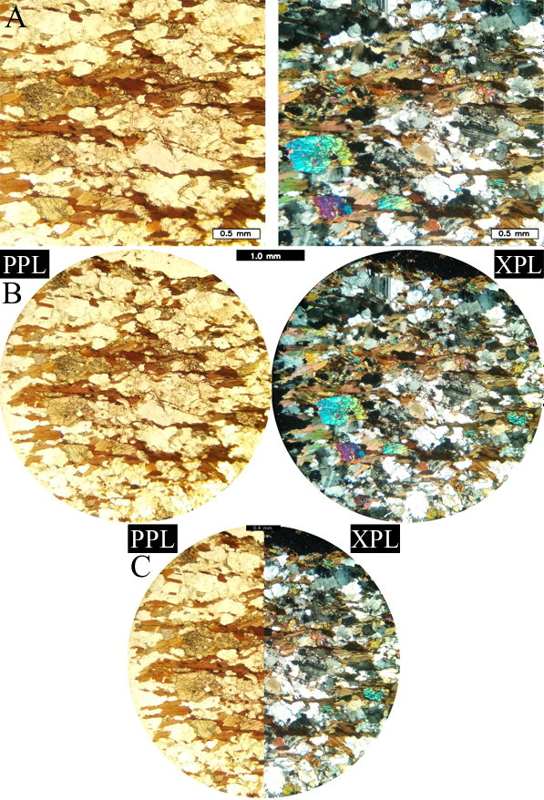
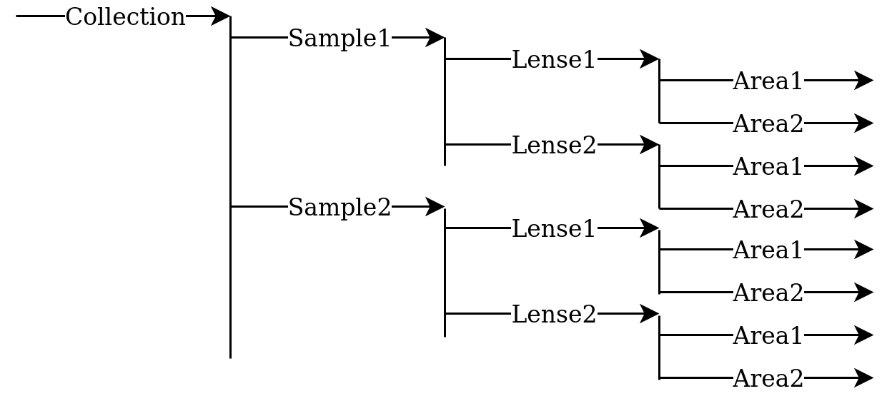

# petro (v1.0)

This application provides photographing petrographic thin sections under microscopic with use  computer  and Android devices control of scrcpy.

### Summary

 - Linux:
 - Windows:

